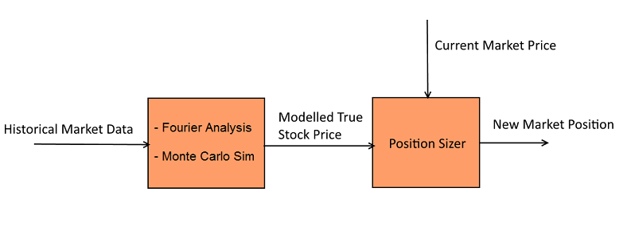

```{r load-data, echo=FALSE, eval=TRUE, results='hide',message=FALSE}
library(plyr)
library(knitr)
library(knitcitations)
library(RefManageR)
library(ggplot2)
library(grid)
library(gridExtra)
library(XLConnect)
library(reshape2)
library(png)
library(grid)

cleanbib()
cite_options(style="markdown")

bibZiplineIO <- bibentry(bibtype="Misc", 
                              author=person(family="Quantopian, Inc"),
                              title="Zipline, a Pythonic Algorithmic Trading Library",
                              year=2015,
                              url="https://github.com/quantopian/zipline"
                              )

bibGithub <- bibentry(bibtype="Misc",
                      author=personList(person(given="Daniel", family="Dittenhafer"), 
                                        person(given="Justin", family="Hink")),
                      title="stockyPuck",
                      year=2015,
                      url="https://github.com/dwdii/stockyPuck")


# My ggplot theme
myTheme <- theme(axis.ticks=element_blank(),
                 axis.title=element_text(size="10"),
                  panel.border = element_rect(color="gray", fill=NA), 
                  panel.background=element_rect(fill="#FBFBFB"), 
                  panel.grid.major.y=element_line(color="white", size=0.5), 
                  panel.grid.major.x=element_line(color="white", size=0.5),
                  plot.title=element_text(size="10"))
```

## Introduction

The stock market;  For as long as it has existed, it has fascinated its' participants and observers alike.  The lure of a seemingly labourless path to wealth through our markets is perhaps equaled only by the magnitude of the complexity that underly them.  A financial market is a fickle thing, famously tricky to analyze and difficult to derive any true [alpha](https://en.wikipedia.org/wiki/Alpha_(finance)) from.

For this project we've decided to take on this challenge and have developed 3 distinct mathematically driven algorithms that attempt to find an edge in day trading the US equity market.   

## Analysis of the Problem

Buying and selling stocks is a lot like betting on a horse race. There is a lot of uncertainty. Past performance may or may not be an indicator of future success. But knowing as much as you can about the variables involved and balancing those variables appropriately can reap rewards. Everyday people trade shares based on an expectation of a share price increasing or decreasing. Sometimes automated software systems perform trades based on as much available information as an analyst could program into the algorithm. 

How do these analysts model the stock price in a way that they can successfully buy or sell for a profit? There are surely many ways and many variables that can and maybe should be considered, but with this project we wanted to begin understanding what is required to model a stock price using different modeling approaches.

## Methodology

With this in mind, we decided to use the [Zipline.io framework](https://github.com/quantopian/zipline) from the team at [Quantopian, Inc](https://www.quantopian.com/) to test some mathematical modeling ideas against real-world historical stock activity `r citep(bibZiplineIO)`. The Zipline framework makes it very straight forward to focus on the algorithm, while the framework brings in the historical pricing for specified securities, and helps track portfolio value and position over time. There are many features of Zipline we did not use such as commissions and slippage. Rather we focused on the raw behaviour of our algorithms.

Basically, we plugged our models into the Zipline.io framework by deriving from Zipline's `TradingAlgorithm` Python base class and implementing our own `_handle_data` functions. The `_handle_data` function is called for each iteration of a trading day and allows the associated model to reposition the portfolio based on any new information (i.e. that day's current stock price). For more information, refer to the [Zipline documenation](http://www.zipline.io/beginner-tutorial.html).

Our approach included developing (using the Python language) and testing two main models. These models where distinct, but followed the same structure of feeding their output into a "position sizer" which helped us choose how much to buy or sell as a result of the predictions from the given algorithm. 

* Fast Fourier Transform (FFT)

* Monte Carlo Simulation (MC)



### Fast Fourier Transform

A staple of undergraduate electrical and computer engineering programs is the Fourier Transform.  In those domains, it is primarily used in the analysis of electronic signals.  Conceptually, it is a technique used to transform time series data into an equivalent signal in the frequency domain.  Mathematically, it looks like this for a given time series g(t):

$$
\begin{aligned}
F \{ g(t)\} =G(f)=\int _{ -\infty  }^{ \infty  }{ { g(t) }e^{ -2\pi ift }dt }  
\end{aligned}
$$

In the following example, we take a sinusoid consisting of 2 clear frequency components and show what the transformed frequency spectrum plot looks like.

$$
\begin{aligned}
g(t)=sin(2\pi { f }_{ 1 }t)+\frac { 1 }{ 2 } sin(2\pi { f }_{ 2 }t) 
\end{aligned}
$$
$$
\begin{aligned}
{ f }_{ 1 }=50Hz\\ { f }_{ 2 }=80Hz 
\end{aligned}
$$

```{r fftimg1,echo=FALSE,message=FALSE}
img <- readPNG('./figures/fdomainEx-sm.png')
 grid.raster(img)
```


At first this may all seem fairly irrelevant to financial markets but there is one key similarity.  Both an electric signal and a stock chart are, at a fundamental level, a time series of data points.  Given that then, perhaps some of the common techniques to clean electrical signals can be applied to financial data.

One such technique is low pass frequency filtering.  A low pass frequency filter removes the high frequency components of a signal.  In the context of the above example, if we filtered out all frequencies higher than 60 Hz, we'd be left with a frequency spectrum plot that has only one remaining spike (at 50Hz).  

Trading thesis:  a financial time series is just a noisy signal.  If we remove the high frequency components of the signal (the noise), we will be left with a purer signal.  This filtered signal would represent the "true" price of a given equity throughout time.  With knowledge of what the true price is, we can contrast that with the current market price and make trading decisions off of that gap.

The following is a stock chart for General Electric.  The green line represents the market price throughout time.  The blue, smooth line is the filtered signal using the above mentioned low pass filtering technique.

```{r fftimg2,echo=FALSE,message=FALSE}
img2 <- readPNG('./figures/smoothed_stock_ex-sm.png')
 grid.raster(img2)
```

In summary, this algorithm follows the below high level steps.

- Transform the time series into it's frequency domain representation using the Fourier Transform.
- Filter out the high frequency components of the signal
- Transform the filtered signal back to a time series representation using the inverse Fourier Transform.

The following code shows the logical flow of these steps.

```{python, eval=FALSE}
  #get spectrum of signal with Fourier Transform using built in scipy method
  F = fft(s)
  
  #filter high frequency components of signals
  dt = 1/252.0
  f = fftfreq(len(F),dt)  # get sample frequency in samples per year
  
  F_filt = self.getfilteredsignal(F,f)
  F_filt = np.array(F_filt)
  
  # take inverse FFT to get smoothed time series signal
  s_filt = ifft(F_filt)
```

Note that the fft() and ifft() functions are included in the scipy library which we have utilized for this project.  The library's implmentation is both blazing fast and well tested throughout industry and academia.

The details of the low pass filter can be seen in the following code snippet:

```{python, eval=FALSE}
        if abs(freq)> (highCut+buff):
            return 0
        else:
            return x
```
The implementation of the filter is trivial in the frequency domain. It consists of a single if-else block.  This conceptual simplicity is perhaps the main motivator in using the Fourier Transform to flip our signal to the frequency domain before filtering.  Pure time series techniques for frequency filtering do exist but they are more complicated.  Additionally, frequency domain low pass filtering is computationally more efficient compared to the time domain equivalents.

$$
\begin{aligned}
O({ n }^{ 2 })\quad for\quad Time\quad Domain 
\end{aligned}
$$
$$
\begin{aligned}
O(nlogn)\quad for\quad Freq\quad Domain 
\end{aligned}
$$

### Monte Carlo Simulation

The Monte Carlo simulation used the daily price differences from the prior 10 days as a basis for a normal distribution. The mean and standard deviation where computed from the price difference vector and passed to the `monteCarloIteration` function for sampling over the distribution. The sampling was performed 100 times, as defined by the `mcIterations` variable. After gathering the possible price changes, we used the mean of these as tomorrow's predicted price, as shown on the last line of the code segment below. 

```{python, eval=FALSE}
priceDiffs = histData[sym].diff()
meanDiff = priceDiffs.mean()
sdDiff = priceDiffs.std()

mcResults = list()
for i in range(0, self.mcIterations, 1):
    res = self.monteCarloIteration(meanDiff, sdDiff, curPrice)
    mcResults.append(res)
# Convert to a pandas series so we can use the statistics functions.
mcResultsPd = pd.Series(mcResults)

# What is the price we predict for tomorrow?
predictedPrice = mcResultsPd.mean()
```

The `monteCarloIteration` function is structured with the capability to predict prices \(n\) days in the future and could also be used for a crude value-at-risk computation. For our purposes, we only sample and walk 1 day into the future (`mcFutureDays` \(= 1\)), thereby returning tomorrow's predicted price for the given Monte Carlo iteration.

```{python, eval=FALSE}
def monteCarloIteration(self, mean, std, start):
    import random
    sample = list()
    for i in range(0, self.mcFutureDays, 1):
        sample.append(random.gauss(mean, std))

    curPrice = start
    walk = list()
    for d in sample:
        newPrice = curPrice + d
        curPrice = newPrice
        walk.append(curPrice)

    return walk[-1]
```


### Kelly Criterion

**TBD - Justin**

## Findings

In order to test the models, we selected a set of 10 securities, mostly stocks and the S&P 500, and measured the performance of the models based on their ending portfolio value after 4 years. Each model was executed once per security with a starting portfolio value of $100,000.00 on January 1, 2010 for a total of 20 model runs. The models had the opportunity to buy or sell shares of the security each day until January 1, 2014.  

- Portfolio Starting Value: $100,000
- Back test: Jan 1, 2010 - Jan 1, 2014 (4 years)
- Variety of stocks and Index fund of S&P500

### Raw Results

The results of each run are listed in the following table:

```{r, message=FALSE, echo=FALSE}
# Load the results data
wb = loadWorkbook("../Test Results/results.xlsx")
dfResults = readWorksheet(wb, sheet = "Sheet1", header = TRUE)
# Melt to convert to a format friendly to ggplot for Algo bar chart
dfResMeltedVal <- melt(dfResults, id.vars=c("Symbol", "Company"), 
                    variable.name="Algorithm",
                    measure.vars=c("FFT_EndPortfolioValue", "MC_EndPortfolioValue"))
# Melt to convert to a format friendly to ggplot for another Algo bar chart
dfResMeltedRoi <- melt(dfResults, id.vars=c("Symbol", "Company"), 
                    variable.name="Algorithm",
                    measure.vars=c("FFT_Annual.ROI", "MC_Annual.ROI"))

#summary(dfResults)
```

```{r, echo=FALSE}
kable(dfResults[, c("Symbol", "Company", "FFT_EndPortfolioValue", "MC_EndPortfolioValue")], 
      format.args=list(big.mark=","))
```

The results are a bit easier to view visually. From this view, it might seem the Fourier Transform is performing better than the Monte Carlo Simulation.

```{r, message=FALSE, echo=FALSE, fig.height=4, fig.width=7.5}
g1 <- ggplot(dfResMeltedVal) + 
  geom_bar(aes(x=Symbol, y=value, fill=Algorithm), stat="identity", position="dodge") +
  labs(title="Algorithm Ending Value by Symbol") +
  myTheme
g1
```

Certainly the Fourier Transform's mean and median are higher than the Monte Carlo approach, though the standard deviation is higher as well.

```{r, message=FALSE, echo=FALSE}
dfStats <- ddply(dfResMeltedVal, .(Algorithm), summarize,
            median=median(value),
            mean=mean(value), 
            sd=sd(value),
            n=length(value))

kable(dfStats, format.args=list(big.mark=","))
```

What do the results look like when viewed from an annualized return perspective? Again, it seems the Fourier Transform is performing better than the Monte Carlo Simulation.

```{r, message=FALSE, echo=FALSE, eval=TRUE, fig.height=4, fig.width=7.5}
g1 <- ggplot(dfResMeltedRoi) + 
  geom_bar(aes(x=Symbol, y=value, fill=Algorithm), stat="identity", position="dodge") +
  labs(title="Algorithm Return on Investment by Symbol") +
  myTheme
g1
```


```{r, message=FALSE, echo=FALSE, eval=TRUE}
dfStatsRoi <- ddply(dfResMeltedRoi, .(Algorithm), summarize,
            median=median(value),
            mean=mean(value), 
            sd=sd(value))
kable(dfStatsRoi, format.args=list(big.mark=","))
```

### Hypothesis Test: Fourier Transform

How can we conclusively test to see if our models are actually performing better than doing nothing? A statistical hypothesis test could work. First let's run a test to see if the model's ending portolio value is higher than the starting value. We'll run this upper tail test with a 0.05 alpha level, meaning a 95% confidence level. 

\[H_0: \mu_{model} = 100,000\]

\[H_a: \mu_{model} > 100,000\]

\[\alpha = 0.05\]

We'll start by applying our hypothesis test to the Fourier Transform. We need to check the distribution of the data to ensure it is a nearly normal. The closer the data is to the diagonal line, evenly spread, the better.

```{r, echo=FALSE, fig.height=4, fig.width=7.5}
qqnorm(dfResults$FFT_EndPortfolioValue)
qqline(dfResults$FFT_EndPortfolioValue) 
```

As shown in the Q-Q plot, above, there are deviations from the normal distribution, but for our purposes we accept this a nearly normal and can move forward with the hypothesis test. The following `R` code computes the relevant statistics which are presented below.

```{r, echo=TRUE}
# Grab the raw statistics out of the data frame
fftStats <- dfStats[dfStats$Algorithm == "FFT_EndPortfolioValue",]
mean <- fftStats$mean
sd <- fftStats$sd
n <- fftStats$n
df <- n - 1

# Compute t-test values and CI margin of error
se <- sd / sqrt(n)
tVal95 <- qt(0.975, df=df)
me <- tVal95 * se

# t score and p value
tScore <- (mean - 100000) / se
pVal <- pt(tScore, df, lower.tail=FALSE)
```

The standard error of the sample mean is computed as follows:

\[SE_{fft} = \frac{`r format(sd, scientific=FALSE, big.mark=",")`}{\sqrt{`r n`}} = `r format(se, scientific=FALSE, big.mark=",")`\]

And our t-score for this hypothesis test is computed as:

\[T_{fft} = \frac{`r format(mean, scientific=FALSE, big.mark=",")` - 100,000}{`r format(se, scientific=FALSE, big.mark=",")`} = `r format(tScore, scientific=FALSE)` \]

\[\text{p-value }= `r format(pVal, scientific=FALSE)`  > 0.05\]

95% Confidence Interval: \(`r format(mean, scientific=FALSE, big.mark=",")` \pm `r format(me, scientific=FALSE, big.mark=",")` = \)
\(`r format(mean - me, scientific=FALSE, big.mark=",")`\) to \(`r format(mean + me, scientific=FALSE, big.mark=",")` \)

Based on the p-value \(\approx `r round(pVal, 4)`\) and the 95%CI crossing the portfolio starting value of 100,000, we accept the null hypothesis and conclude that the Fourier Transform model, as written, is not performing significantly better.

### Hypothesis Test: Monte Carlo

Next up, we will perform the same hypothesis test on the Monte Carlo Simulation. Again, we check the normality of the data and find a nearly normal distribution, as shown in the following Q-Q plot.

```{r, echo=FALSE}
qqnorm(dfResults$MC_EndPortfolioValue)
qqline(dfResults$MC_EndPortfolioValue) 
```

Once again, we use `R` to help us with the mathematics of the hypothesis test. 

```{r, echo=TRUE}
mcStats <- dfStats[dfStats$Algorithm == "MC_EndPortfolioValue",]
mean <- mcStats$mean
sd <- mcStats$sd
n <- mcStats$n
df <- n - 1

# Compute t-test values and CI margin of error
se <- sd / sqrt(n)
tVal95 <- qt(0.975, df=df)
me <- tVal95 * se

# t score and p value
tScore <- (mean - 100000) / se
#tScore
pVal <- pt(tScore, df, lower.tail=FALSE)
#pVal
```

\[SE_{fft} = \frac{`r format(sd, scientific=FALSE, big.mark=",")`}{\sqrt{`r n`}} = `r format(se, scientific=FALSE, big.mark=",")`\]

\[T_{fft} = \frac{`r format(mean, scientific=FALSE, big.mark=",")` - 100,000}{`r format(se, scientific=FALSE, big.mark=",")`} = `r format(tScore, scientific=FALSE)` \]

\[\text{p-value }= `r format(pVal, scientific=FALSE)`  > 0.05\]

95% Confidence Interval: \(`r format(mean, scientific=FALSE, big.mark=",")` \pm `r format(me, scientific=FALSE, big.mark=",")` = \)
\(`r format(mean - me, scientific=FALSE, big.mark=",")`\) to \(`r format(mean + me, scientific=FALSE, big.mark=",")` \)

Based on the p-value \(\approx `r round(pVal, 4)`\) and the 95%CI crossing the portfolio starting value, we accept the null hypothesis and conclude that the Monte Carlo model as written is not performing significantly better.

### Difference of Means Test

Now, let's look at how the Fourier Transform compares to the Monte Carlo approach. Are they similar, or is the Fourier Transform performing better at a statistically significant level? We setup our hypothesis test as a difference of means as shown with the following null and alternate hypotheses.

\[H_0: \mu_{fft} = \mu_{mc}\]

\[H_a: \mu_{fft} > \mu_{mc}\]

\[\alpha = 0.05\]

We perform the calculations in `R` code as shown below, followed by the mathematical notation.

```{r, echo=TRUE}
# Compute standard error and difference of means
se_diff <- sqrt((fftStats$sd^2 / fftStats$n) + (mcStats$sd^2 / mcStats$n))
mean_diff <- fftStats$mean - mcStats$mean

# Compute t-score and lookup p-value
tScore_diff <- (mean_diff - 0) / se_diff
pVal <- pt(tScore_diff, df, lower.tail=FALSE)
```

\[SE_{\bar{x}_{fft} - \bar{x}_{mc}} = \sqrt{\frac{`r format(fftStats$sd, scientific=FALSE, big.mark=",")`^2}{`r fftStats$n`} + \frac{`r format(mcStats$sd, scientific=FALSE, big.mark=",")`^2}{`r mcStats$n`} } = `r format(se_diff, scientific=FALSE, big.mark=",")`\]

\[T_{diff} = \frac{`r format(mean_diff, scientific=FALSE, big.mark=",")` - 0}{`r format(se_diff, scientific=FALSE, big.mark=",")`} = `r format(tScore_diff, scientific=FALSE)` \]

\[\text{p-value }= `r format(pVal, scientific=FALSE)`  > 0.05\]

Based on the p-value \(\approx `r round(pVal, 4)`\) we do not reject the null hypothesis and therefore conclude that the Fast Fourier Transform is not significantly better than the Monte Carlo Simulation.


## Conclusions

After developing and testing 2 main models combined with a position sizing Kelly Criterion, we found our models were not much better than keeping our money under our pillows. And surprisingly, neither model was significantly better than the other. Possibly with a broader test set (i.e. more stocks) we could better discern a difference between the methods. With that said, we believe the models are a good place to start for further tuning and improvement. 

Mathematical models are notoriously poor at predicting outside their original data set range, and predicting the future (an unknown) is implicitly outside the data set range. The approach we took was generic for any stock or mutual fund, but developing more specific approaches, based on industry or security type, might yield improved results.

The original code, test results, paper and presentation are available in the [stockyPuck repository on Github](https://github.com/dwdii/stockyPuck) `r citep(bibGithub)`.

## Referernces

```{r, results='asis', echo=FALSE}
BibOptions(style="html", bib.style="authortitle")
bibliography()
```
